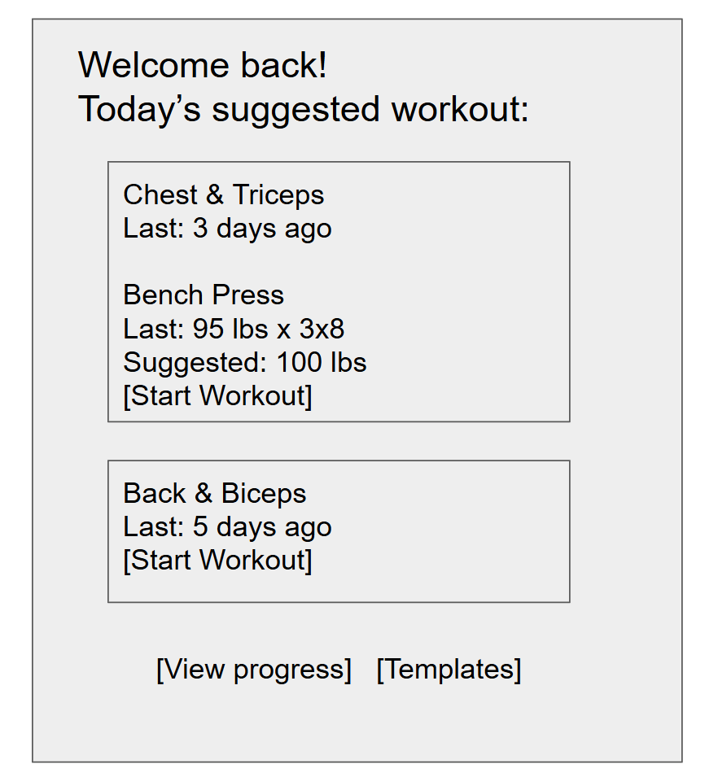
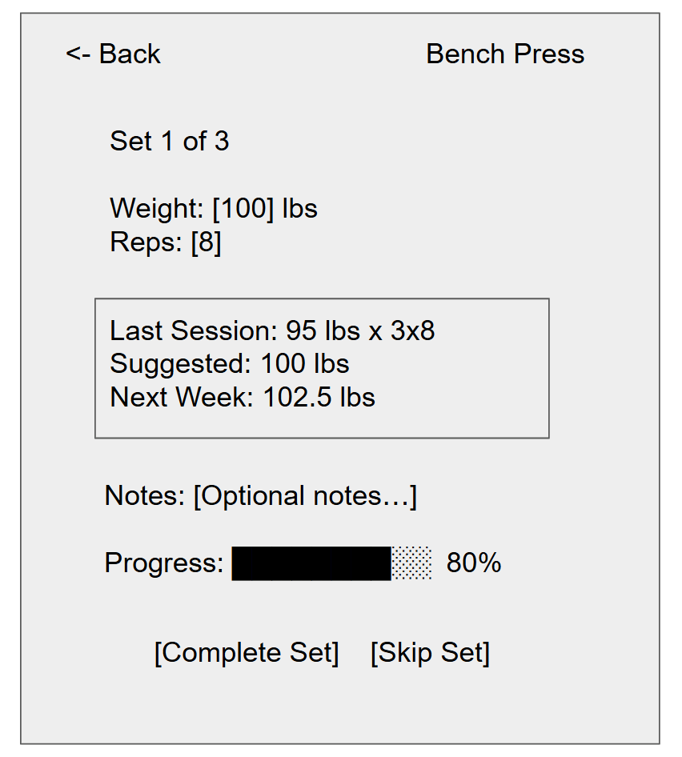
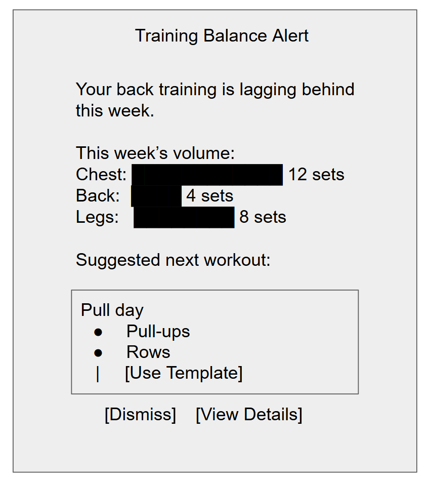
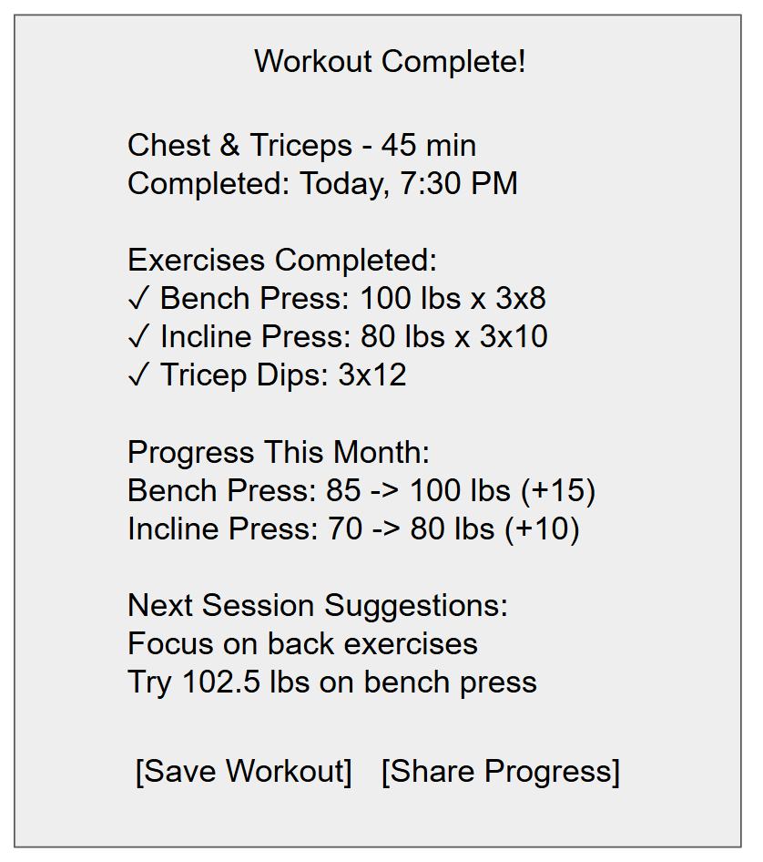

# Assignment 2

## Problem statment

### Problem Domain: Health and Fitness

I started lifting weights at the gym a couple of years ago, and now I go consistently. I feel like the gym as well as any other physical activity such as sports should be a part of everyone's day to day lives. Keeping your body in shape is important and should not be ignored.

### Problem: Forgetting previous workouts or weights 

Sometimes I forget how much weight I put on an exercise or if I should increase the weight after some amount of time. This is important because slowly building up weight is key to muscle growth. This problem is highly worth pursuing because it's a specific, well-defined issue that directly impacts fitness progress. I have personal experience with this challenge, which gives me insights into what features would be most useful. This problem affects a large community of fitness enthusiasts, so there's some sort of demand. 

### Stakeholder list
- Fitness Enthusiasts - Individuals who regularly exercise and track their progress
- Personal Trainers - Professionals who help clients achieve fitness goals
- Everyday People - People who do not regularly exercise

Fitness enthusiasts are the primary users who would directly benefit from better workout tracking, leading to more consistent progress and motivation. Personal trainers would be significantly affected as they could better monitor client progress and provide more accurate guidance based on historical data. This could improve their service quality and client retention. Everyday people who don't regularly exercise would be positively impacted as better tracking tools could lower the barrier to starting a fitness routine by providing clear guidance on what to do and how to progress, potentially encouraging them to become more active and develop healthier habits.

### Evidence and comparables

- Impact on physical activity: Studies show that fitness app users engage in significantly more structured physical activity per week than non-users, demonstrating the potential benefits of consistent tracking when maintained. ([pmc.ncbi.nlm.nih.gov](https://pmc.ncbi.nlm.nih.gov/articles/PMC7301264))

- Varying the workout: Even if you follows a specific routine, it’s important to give attention to different muscle groups. Incorporating cardio or aerobic exercises alongside strength training creates a balanced fitness program. Design a routine that promotes overall strength, endurance, and a well-rounded physique.([cphins.com](https://cphins.com/top-10-things-people-forget-to-do-when-they-workout/))

- Why to keep a training log: A training log is a powerful tool to get more out of your workouts. It helps you record and organize details about your exercise routine, making it easier to track progress toward your goals. It can also serve as motivation, giving you that extra push to stay consistent on days when you feel tired or too busy to train. ([urmc.rochester.edu](https://www.urmc.rochester.edu/encyclopedia/content?contenttypeid=1&contentid=1037))

- Wearable fitness trackers: Devices automatically track certain activities but may lack detailed weight and set tracking capabilities, and their accuracy can be affected by sensor limitations and user compliance. ([Fitbit](https://en.wikipedia.org/wiki/Fitbit))

- Stuck on the same weight: From personal experience, I have been lifting the same weights for many months, without wanting to increase and improve. Tracking each workout and weights can help me to set a goal for myself and constantly improve, even if it is a slow improvement.

## Application Pitch

### Name: PlateMate

### Motivation: 

It’s easy to forget last session’s weights and miss steady progression. PlateMate keeps your training history at your fingertips and guides small, consistent improvements so you can build strength safely and confidently.

### Key Features

- Smart Weight Recall: Automatically surfaces the last-used weight, sets, and reps for every exercise as you start your session. This eliminates guesswork, speeds up setup time, and reduces accidental undertraining or overreaching. Fitness enthusiasts can get faster, more consistent sessions, personal trainers gain clearer visibility into client adherence and progress.

- Auto‑Progress & Deload Suggestions: Uses simple rules (e.g., hit target reps two sessions in a row -> +2.5-5 lb; miss targets -> hold or deload) to recommend the next load. You can accept, adjust, or skip with one tap. This supports progressive overload while preventing plateaus and burnout. Lifters make steady gains, trainers can standardize progression, new or irregular exercisers get safe, confidence‑building guidance.

- Balanced Routine Planner: Tracks weekly muscle‑group volume and nudges you to rotate movements (e.g., push/pull/legs) and include cardio or mobility when appropriate. Quick templates let you save favorite sessions and reuse them. Enthusiasts avoid overuse and stagnation, trainers deliver better‑rounded programming, everyday users get a simple path to a well‑balanced routine.

Together, these features turn fragmented workout memories into a structured training log that motivates progress. PlateMate is simple enough for beginners yet precise enough for experienced lifters and coaches, helping every stakeholder stay consistent, progress safely, and see tangible results week over week.

## Concept Design

### Concept Specifications

~~~
concept WorkoutTracking [User, Exercise]
  purpose maintain historical workout data for progression tracking
  principle each workout session records exercises with weights, sets, and reps
  state
    a set of WorkoutSessions with
      user User
      date Date
      sessionId String
    a set of ExerciseRecords with
      sessionId String
      exercise Exercise
      weight Number
      sets Number
      reps Number
      notes String?
  actions
    startSession (user: User, date: Date) : (sessionId: String)
      effect creates new workout session
    recordExercise (sessionId: String, exercise: Exercise, weight: Number, sets: Number, reps: Number, notes: String?)
      requires sessionId exists
      effect adds exercise record to session
    getLastWeight (user: User, exercise: Exercise) : (weight: Number?)
      effect returns most recent weight for exercise by user, or null if none
    getWorkoutHistory (user: User, exercise: Exercise, limit: Number) : (records: List<ExerciseRecord>)
      effect returns recent exercise records sorted by date descending
~~~

~~~
concept ProgressionEngine [User, Exercise]
  purpose automatically suggest weight progressions based on performance
  principle progressive overload through systematic weight increases
  state
    a set of ProgressionRules with
      exercise Exercise
      increment Number
      deloadThreshold Number
      targetSessions Number
    a set of UserProgressions with
      user User
      exercise Exercise
      currentWeight Number
      sessionsAtWeight Number
      lastProgression Date
  actions
    suggestWeight (user: User, exercise: Exercise, lastWeight: Number, lastSets: Number, lastReps: Number) : (suggestion: WeightSuggestion)
      effect calculates next weight based on performance and rules
    updateProgression (user: User, exercise: Exercise, newWeight: Number)
      effect updates user's current weight and resets session counter
    getProgressionRule (exercise: Exercise) : (rule: ProgressionRule?)
      effect returns progression rule for exercise type
~~~

~~~
concept RoutinePlanner [User, Exercise]
  purpose manage workout templates and balance muscle group training
  principle ensure balanced training across muscle groups and movement patterns
  state
    a set of WorkoutTemplates with
      templateId String
      name String
      exercises List<Exercise>
      muscleGroups Set<MuscleGroup>
    a set of UserTemplates with
      user User
      templateId String
      isDefault Boolean
    a set of WeeklyVolume with
      user User
      muscleGroup MuscleGroup
      weekStart Date
      volume Number
  actions
    createTemplate (user: User, name: String, exercises: List<Exercise>) : (templateId: String)
      effect creates new workout template
    getSuggestedWorkout (user: User, date: Date) : (template: WorkoutTemplate?)
      effect returns template based on recent training volume and balance
    updateVolume (user: User, exercise: Exercise, sets: Number, reps: Number, weight: Number)
      effect updates weekly volume for exercise's muscle groups
    checkBalance (user: User, weekStart: Date) : (imbalance: List<MuscleGroup>)
      effect returns muscle groups with significantly lower volume
~~~

~~~
concept UserManagement [User]
  purpose manage user accounts and preferences
  principle each user has unique identity and customizable settings
  state
    a set of Users with
      userId String
      username String
      email String
      preferences UserPreferences
    a set of UserPreferences with
      userId String
      defaultIncrement Number
      units String
      notifications Boolean
  actions
    createUser (username: String, email: String) : (userId: String)
      requires username and email are unique
      effect creates new user with default preferences
    updatePreferences (userId: String, preferences: UserPreferences)
      requires user exists
      effect updates user preferences
    getUser (userId: String) : (user: User?)
      effect returns user if exists
~~~

~~~
concept ExerciseCatalog [Exercise]
  purpose maintain database of exercises with metadata
  principle standardized exercise information for consistent tracking
  state
    a set of Exercises with
      exerciseId String
      name String
      muscleGroups Set<MuscleGroup>
      movementPattern String
      equipment String?
      instructions String?
  actions
    addExercise (name: String, muscleGroups: Set<MuscleGroup>, movementPattern: String, equipment: String?, instructions: String?) : (exerciseId: String)
      effect adds new exercise to catalog
    searchExercises (query: String, muscleGroup: MuscleGroup?) : (exercises: List<Exercise>)
      effect returns exercises matching search criteria
    getExercise (exerciseId: String) : (exercise: Exercise?)
      effect returns exercise details
~~~

### Essential Synchronizations

~~~
sync startWorkout
  when
    UserManagement.getUser (userId) : (user)
    WorkoutTracking.startSession (user, date) : (sessionId)
  then
    RoutinePlanner.getSuggestedWorkout (user, date) : (template)

sync recordExercise
  when
    WorkoutTracking.recordExercise (sessionId, exercise, weight, sets, reps, notes)
    WorkoutTracking.getLastWeight (user, exercise) : (lastWeight)
  then
    ProgressionEngine.suggestWeight (user, exercise, lastWeight, sets, reps) : (suggestion)
    RoutinePlanner.updateVolume (user, exercise, sets, reps, weight)

sync applyProgression
  when
    ProgressionEngine.suggestWeight (user, exercise, lastWeight, lastSets, lastReps) : (suggestion)
    UserManagement.getUser (userId) : (user)
  then
    ProgressionEngine.updateProgression (user, exercise, suggestion.newWeight)

sync checkBalance
  when
    RoutinePlanner.updateVolume (user, exercise, sets, reps, weight)
    RoutinePlanner.checkBalance (user, weekStart) : (imbalance)
  then
    RoutinePlanner.getSuggestedWorkout (user, nextDate) : (balancedTemplate)
~~~

### Brief note

These concepts work together to deliver PlateMate's core functionality. **WorkoutTracking** serves as the foundation, storing all historical workout data that enables progression tracking and routine planning. **ProgressionEngine** uses this data to automatically suggest weight increases based on performance, implementing the "Auto-Progress & Deload Suggestions" feature. **RoutinePlanner** ensures balanced training by tracking weekly volume across muscle groups and suggesting appropriate workout templates, delivering the "Balanced Routine Planner" feature. **UserManagement** handles authentication and user preferences, while **ExerciseCatalog** provides a standardized database of exercises with proper muscle group classifications.

The generic type parameters are instantiated as follows: `User` represents individual fitness enthusiasts, personal trainers, or everyday users; `Exercise` represents specific movements like "Bench Press" or "Squat" with associated metadata; `MuscleGroup` represents body parts like "chest", "back", "legs"; and `Date` represents workout session timestamps. The synchronizations ensure that when users record exercises, the system automatically updates progression suggestions, tracks volume for balance checking, and maintains the historical data needed for the "Smart Weight Recall" feature.

## UI Sketches

### Figure 1: Home Screen

### Figure 2: Exercise Recording Screen

### Figure 3: Balance Alert

### Figure 4: Workout Summary

## User Journey

An everyday person has been lifting weights for about a year but feels stuck in his progress. He arrives at the gym, ready for his chest and triceps workout, but realizes he can't remember what weight he used for bench press last week. "Was it 95 pounds or 100?" he thinks, frustrated. This happens almost every session - he either guesses and potentially undertrains, or plays it safe and uses a lighter weight, missing opportunities for progression.

He opens PlateMate on his phone and logs into his account. The app immediately shows him "Today's Suggested Workout" based on his training history and current week's volume (Figure 1: Home Screen). He sees that PlateMate has automatically loaded his last bench press session: 95 pounds for 3 sets of 8 reps. The app suggests he try 100 pounds today since he completed all his target reps last time. This "Smart Weight Recall" feature eliminates his guesswork and gives him confidence to push himself appropriately.

As he completes his first set of bench press at 100 pounds, he records it in the app (Figure 2: Exercise Recording Screen). PlateMate's "Auto-Progress & Deload Suggestions" feature immediately analyzes his performance and suggests 102.5 pounds for next week if he completes all sets successfully. The app also updates his weekly chest volume and shows a notification that his back training is lagging behind - suggesting he focus on pull exercises in his next session (Figure 3: Balance Alert).

After finishing his workout, he reviews his session summary (Figure 4: Workout Summary). He's pleased to see he's made steady progress over the past month, with his bench press increasing from 85 to 100 pounds. The app's "Balanced Routine Planner" has helped him maintain consistent training across all muscle groups, and he feels more motivated knowing exactly where he stands and where he's heading. He leaves the gym feeling accomplished and confident about his next session, knowing PlateMate will guide him continued progress.
