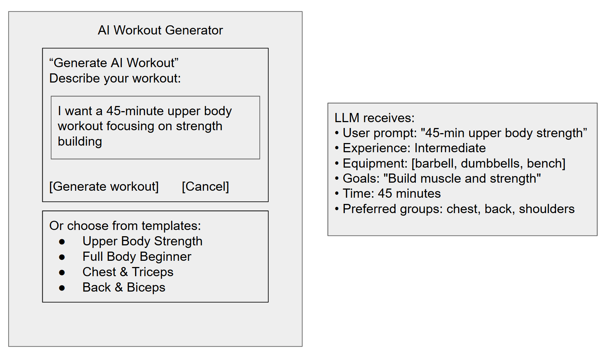
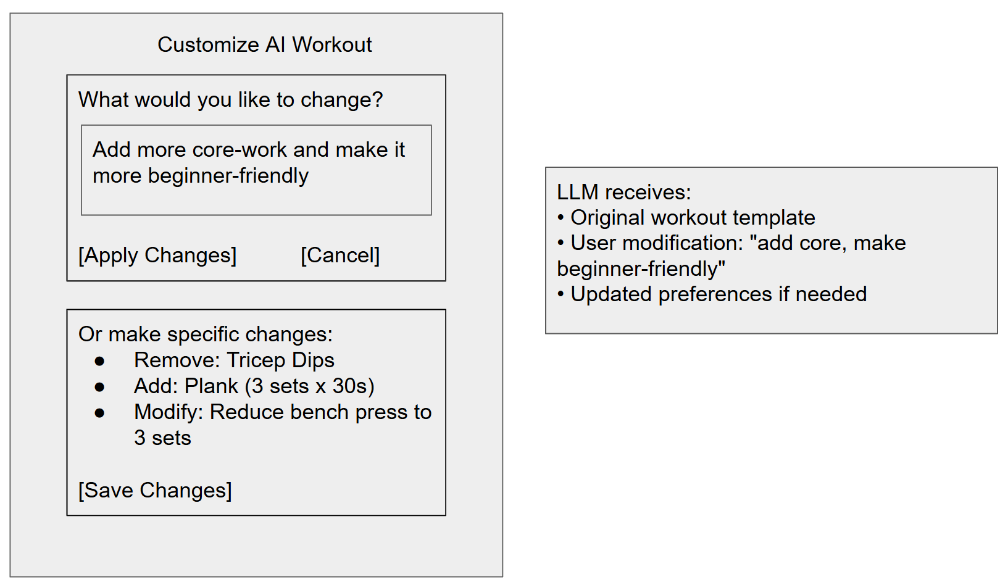

# Assignment 3

## Augment the design of a concept

~~~
concept RoutinePlanner [User, Exercise]
  purpose manage workout templates and balance muscle group training
  principle ensure balanced training across muscle groups and movement patterns
  state
    a set of WorkoutTemplates with
      templateId String
      name String
      exercises List<Exercise>
      muscleGroups Set<MuscleGroup>
    a set of UserTemplates with
      user User
      templateId String
      isDefault Boolean
    a set of WeeklyVolume with
      user User
      muscleGroup MuscleGroup
      weekStart Date
      volume Number
  actions
    createTemplate (user: User, name: String, exercises: List<Exercise>) : (templateId: String)
      effect creates new workout template
    getSuggestedWorkout (user: User, date: Date) : (template: WorkoutTemplate?)
      effect returns template based on recent training volume and balance
    updateVolume (user: User, exercise: Exercise, sets: Number, reps: Number, weight: Number)
      effect updates weekly volume for exercise's muscle groups
    checkBalance (user: User, weekStart: Date) : (imbalance: List<MuscleGroup>)
      effect returns muscle groups with significantly lower volume
~~~

~~~
concept AIRoutinePlanner [User, Exercise]
  purpose manage workout templates with AI-powered generation and balance muscle group training
  principle ensure balanced training across muscle groups with intelligent template generation from natural language
  state
    a set of WorkoutTemplates with
      templateId String
      name String
      exercises List<Exercise>
      muscleGroups Set<MuscleGroup>
      isAIGenerated Boolean
      generationPrompt String?
    a set of UserTemplates with
      user User
      templateId String
      isDefault Boolean
    a set of WeeklyVolume with
      user User
      muscleGroup MuscleGroup
      weekStart Date
      volume Number
    a set of UserPreferences with
      user User
      experienceLevel String
      goals String
      availableEquipment List<String>
      timePerSession Number
      preferredMuscleGroups List<MuscleGroup>
  actions
    createTemplate (user: User, name: String, exercises: List<Exercise>) : (templateId: String)
      effect creates new workout template
    generateWorkoutFromPrompt (user: User, prompt: String, preferences: UserPreferences) : (template: WorkoutTemplate?)
      effect uses LLM to generate workout template from natural language description
      requires valid user preferences and prompt
    getSuggestedWorkout (user: User, date: Date) : (template: WorkoutTemplate?)
      effect returns template based on recent training volume and balance
    updateVolume (user: User, exercise: Exercise, sets: Number, reps: Number, weight: Number)
      effect updates weekly volume for exercise's muscle groups
    checkBalance (user: User, weekStart: Date) : (imbalance: List<MuscleGroup>)
      effect returns muscle groups with significantly lower volume
    customizeWorkout (user: User, templateId: String, modifications: String) : (template: WorkoutTemplate?)
      effect uses LLM to modify existing template based on natural language requests
    analyzeWorkout (user: User, templateId: String) : (analysis: String)
      effect uses LLM to provide detailed analysis and recommendations for workout template
~~~

~~~
sync startWorkout
  when
    UserManagement.getUser (userId) : (user)
    WorkoutTracking.startSession (user, date) : (sessionId)
  then
    AIRoutinePlanner.getSuggestedWorkout (user, date) : (template)

sync generateCustomWorkout
  when
    AIRoutinePlanner.generateWorkoutFromPrompt (user, prompt, preferences) : (template)
    UserManagement.getUser (userId) : (user)
  then
    AIRoutinePlanner.createTemplate (user, template.name, template.exercises) : (templateId)

sync recordExercise
  when
    WorkoutTracking.recordExercise (sessionId, exercise, weight, sets, reps, notes)
    WorkoutTracking.getLastWeight (user, exercise) : (lastWeight)
  then
    ProgressionEngine.suggestWeight (user, exercise, lastWeight, sets, reps) : (suggestion)
    AIRoutinePlanner.updateVolume (user, exercise, sets, reps, weight)

sync applyProgression
  when
    ProgressionEngine.suggestWeight (user, exercise, lastWeight, lastSets, lastReps) : (suggestion)
    UserManagement.getUser (userId) : (user)
  then
    ProgressionEngine.updateProgression (user, exercise, suggestion.newWeight)

sync checkBalance
  when
    AIRoutinePlanner.updateVolume (user, exercise, sets, reps, weight)
    AIRoutinePlanner.checkBalance (user, weekStart) : (imbalance)
  then
    AIRoutinePlanner.getSuggestedWorkout (user, nextDate) : (balancedTemplate)
~~~

## Design the user interaction

### Figure 1: AI Workout Generation Entry Point

### Figure 2: Workout Confirmation and Customization

### User Journey Description

The user journey begins when a fitness enthusiast opens PlateMate and wants to try a new workout but isn't sure what to do. They discover the AI workout generator and describe their needs in natural language: "I want a 45-minute upper body workout focusing on strength." The system immediately provides context to the LLM including their experience level, available equipment, and preferences. The AI generates a personalized workout template with appropriate exercises, sets, and reps. The user reviews the generated workout and can either accept it as-is, request modifications through natural language ("add more core work"), or make specific manual adjustments. Once satisfied, they can start their workout with PlateMate's existing smart weight recall and progression tracking features. This seamless integration allows users to benefit from AI-powered workout creation while maintaining access to all of PlateMate's core functionality for tracking and progression.

## Implement your concept

Implemented in ai-coutine-planner folder

## Explore richer test cases and prompts

### Test Case 1: Complex Multi-Constraint Scenario
- **User actions (sequence)**:
  - **Set preferences**: Intermediate experience; goals include strength + cardio health + injury prevention; equipment: barbell, dumbbells, bench, pull-up bar, kettlebell; time per session: 30 min; preferred groups: chest, back, legs, shoulders.
  - **Request generation**: "Create a workout that meets these competing requirements…" (explicit conflicts: short time vs long rest, warm-up cost, 4 groups in 30 min).
  - **Review**: Inspect duration, muscle-group coverage, and rest distributions.
- **LLM-based actions**:
  - Parse competing constraints; propose exercise list with trade-offs (e.g., paired supersets, circuit-style warm-up, capped rest ≤ 180s).
  - Output strictly formatted JSON with workout name conveying the trade-off rationale.
- **Likely failure modes**:
  - Exceeds 30–35 min; too few muscle groups; unstructured or invalid JSON; rest periods inconsistent with constraints.
- **Prompt variant**: Structured constraint-based prompting.
  - Approach: Force explicit analysis, conflict resolution, and validation before emitting JSON.
  - What worked: Better adherence to rest caps and coverage; fewer invalid-JSON errors.
  - What went wrong: Occasionally still over time budget; reasoning not always reflected in exercise choices.
  - Remaining issues: Hallucinated equipment usage and occasional estimate drift on duration.

In this experiment I enforced structure to tame conflicts (time vs rest, warm-up vs volume, four-group coverage). The structured constraint prompt improved JSON validity and rest caps, but the LLM still occasionally exceeded the time budget and sometimes chose exercises that didn’t perfectly reflect the stated reasoning. Equipment hallucinations and duration drift remain the key risks.

### Test Case 2: Ambiguous and Contradictory Instructions
- **User actions (sequence)**:
  - **Set preferences**: Beginner; goals: strength + flexibility; equipment: bodyweight, bands; 45 min.
  - **Request generation**: Intentionally contradictory prompt (intense yet relaxing, bodyweight yet heavy weights, beginner yet advanced, etc.).
  - **Review**: Ensure reasonable name, non-empty plan, plausible 30–60 min estimate.
- **LLM-based actions**:
  - Resolve contradictions via compromises (e.g., intervals combining mobility with strength; RPE scaling; optional progressions).
  - Emit JSON within requested schema.
- **Likely failure modes**:
  - Literal satisfaction attempts (mutually exclusive constraints); unsafe prescriptions for beginners; schema drift.
- **Prompt variant**: Role-based expert prompting.
  - Approach: Assign a seasoned coach persona to prioritize safety and evidence-based compromises.
  - What worked: Safer regressions, clearer rationale, fewer contradictory steps.
  - What went wrong: Sometimes overly conservative; may underdeliver intensity.
  - Remaining issues: Occasional verbosity and slight schema deviations when adding rationale.

Here I used a role-based expert persona to prioritize safety and evidence-based compromises over literal (and impossible) satisfactions. This reduced contradictions and improved beginner suitability, though it sometimes became too conservative and occasionally leaked extra rationale that risked schema drift. Balancing intensity with safety is still fragile under extreme ambiguity.

### Test Case 3: Extreme Edge Cases and Boundary Testing
- **User actions (sequence)**:
  - **Set preferences**: Advanced; goal: extreme challenge; equipment: extensive; 180 min; target many muscle groups.
  - **Request generation**: EXACT 180-minute structured session with warm-up, main work, cool-down; high volume; varied modalities.
  - **Review**: Duration proximity to 180, exercise count (≥ 15), broad muscle coverage, reasonable set bounds.
- **LLM-based actions**:
  - Construct long-form plan with phased structure; calibrate rest and volume to sustain 3 hours.
  - Emit JSON only.
- **Likely failure modes**:
  - Under/over duration by large margin; insufficient breadth; unrealistic set/reps; impractical density for 3 hours.
- **Prompt variant**: Iterative refinement prompting.
  - Approach: Generate three concepts (conservative/balanced/innovative), then select and refine best-fit into final JSON.
  - What worked: More coherent long-duration pacing and coverage; better trade-off selection.
  - What went wrong: Occasional leakage of intermediate text; sometimes merges concepts awkwardly.
  - Remaining issues: Time estimate variance and cumulative fatigue realism remain challenging.

For the 3-hour extreme plan, iterative refinement (three concepts → select → finalize) produced better pacing and coverage. It mitigated single-shot failures but sometimes leaked intermediate text or blended concepts awkwardly. Duration adherence and realistic fatigue management over long sessions remain open issues, suggesting the need for stricter schema guards and pacing heuristics.

These scenarios and prompt variants are implemented and runnable in `ai-routine-planner/advanced-test-cases.ts` via `testComplexMultiConstraint`, `testAmbiguousContradictoryInstructions`, and `testExtremeEdgeCases`, with helpers `createStructuredConstraintPrompt`, `createRoleBasedExpertPrompt`, and `createIterativeRefinementPrompt`.

## Add validators to your code

- **Structurally invalid or infeasible content**: The LLM may emit empty names, zero exercises, extreme sets/reps/rest, or duplicate exercises. I added validators that require a non-empty `workout_name`, a non-empty `exercises` array, enforce bounds on sets (1–10), reps (1–50), rest (15–600s), and forbid duplicate exercises.
- **Preference/feasibility mismatch**: The LLM can hallucinate exercises not supported by the user’s available equipment. I added a validator that computes the available exercise set from `UserPreferences.availableEquipment` and throws if any generated exercise is unavailable.
- **Time budget inconsistency**: The LLM’s `estimated_duration` can be unrealistic versus session budget. I added a simple duration estimator (tempo + rest per set) and validators that (a) bound the deviation between computed duration and `estimated_duration`, and (b) require the plan to be within the user `timePerSession` +- tolerance.

Validators are implemented in `ai-routine-planner/routine-planner.ts` within `validateAIGeneratedTemplate`, and are called after parsing both generation and customization flows.